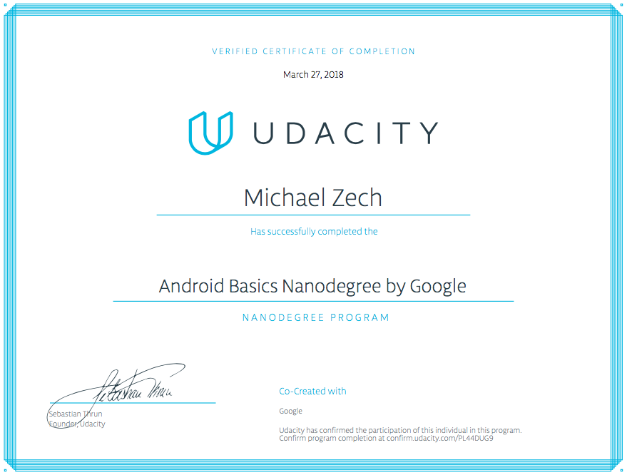

# Android Basics by Google Nanodegree Program

## Projects for Udacity Nandegree [Android Basics](https://de.udacity.com/course/android-basics-nanodegree-by-google--nd803)

1. Build a Single Screen App: Create a single screen app which displays information about a small business.

2. Score Keeper App: Implement a Score Keeper app which keeps track of the scores of two different teams playing a game (Soccer, Football, Baseball etc.).

3. Quiz App: Implement a short quiz app about a topic of own choice.

4. Musical Structure App: Create the structure for a music-player app while using Intents, Arraylists, , New Activities and Custom Classes.

5. Tour Guide App: Create a Tour Guide App which shows information to a user who is visiting a city. City can be choosen by yourself.

6. News App, Stage 1: Implement an app which displays recents news stories.

7. News App, Stage 2: Add an preference screen to the news app.

8. Inventory App, Stage 1: Create an app which allows to keep track of items in an inventory.

9. Inventory App, Stage 2: Improve and enhance the user interface of th inventory app.

